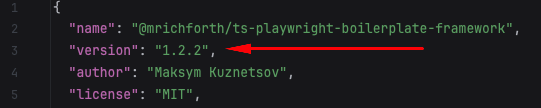
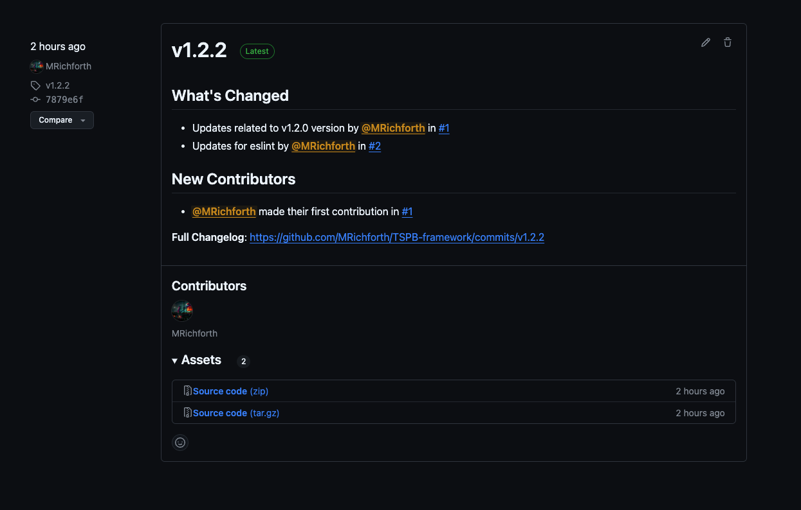
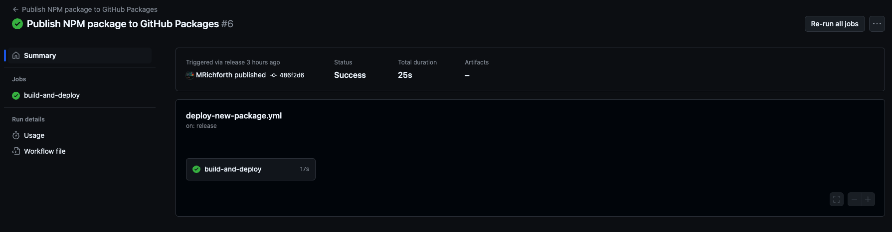
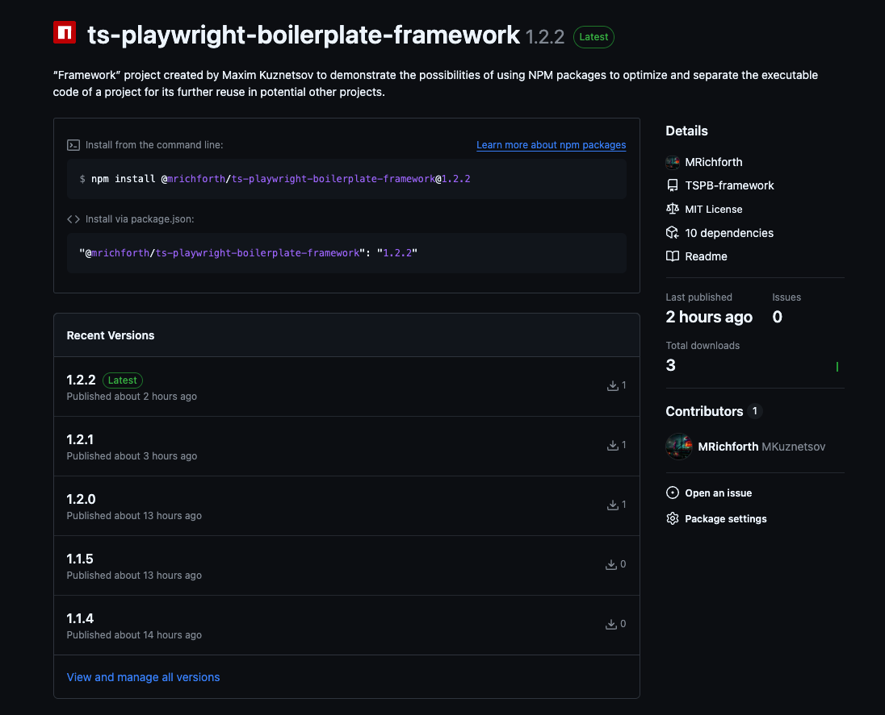
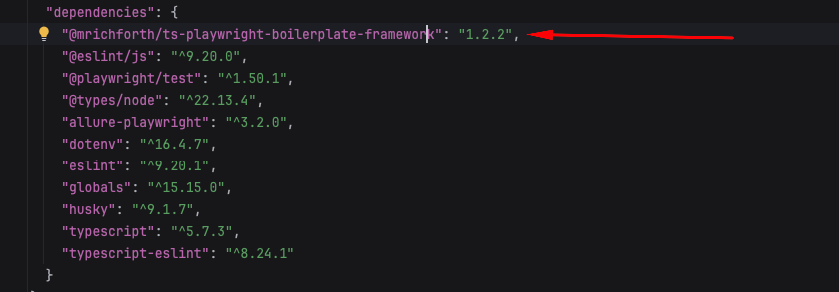

# TSPB framework for [**TS-Playwright-Boilerplate**](https://github.com/MRichforth/TS-Playwright-Boilerplate)

[](https://github.com/MRichforth/TSPB-framework/actions/workflows/deploy-new-package.yml)


The main goal of the “**TSPB framework**” project is to demonstrate the potential of using NPM packages in combination with GitHub Packages functionality to separate page objects and helpers files from [**TS-Playwright-Boilerplate**](https://github.com/MRichforth/TS-Playwright-Boilerplate) for further use of one framework code in several automation projects.
***

## Technologies stack
The following technologies were used to develop the framework:
- **Programming Language**: `TypeScript`
- **Automation Framework**: `Playwright`
- **Additional technologies used**:
    - `GH Actions`
***

## Framework configuration

To start developing classes and methods required to execute automated scenarios, the following steps should be performed:
1. Clone repository
```
git clone https://github.com/MRichforth/TSPB-framework.git
```

2. Install packages
```
npm install
```
3. Install Playwright framework
```
npx playwright install
```
4. Create `.env` file

The following variables should be added to the .env file for this project to work successfully:

|   **NAME**   |                             **VALUE**                             | **Required**  | **Purpose**                                                                                                                                                                                   |
|:------------:|:-----------------------------------------------------------------:|:-------------:|:----------------------------------------------------------------------------------------------------------------------------------------------------------------------------------------------|
|     `CI`     |                              `true`                               |     false     | Responsible for running tests in `HEADLESS` mode                                                                                                                                              |
|  `ENV_URL`   | **https://the-internet.herokuapp.com** <br/>or <br/>`localhost`   |     true      | Responsible for URL of web application to be tested. In case the environment is deployed using Docker on your local machine, you need to specify the port, for example http://localhost:7080. |

5. Create `debug.spec.ts` file

When developing new page object files, as well as methods and classes, it is required to have a possibility to check the functionality of changes

For this reason, the project implements the possibility to run `debug.spec.ts` file using Playwright

To do this, create a `debug.spec.ts` file in the project root and add the following content to it:
```
import {test} from '@playwright/test';
import {AddRemoveElementsPage} from "./pages/add.remove.elements.page";
import {BasePage} from "./pages/base.page";

test.describe('Debug Feature', () => {

    test('Debug scenario', async ({page}) => {
        const basePage = new BasePage(page);
        await basePage.openPage({page: "main"});
        const addRemoveElementsPage = new AddRemoveElementsPage(page);
        await addRemoveElementsPage.validatePage({exclude: 'description'});
    });

});
```

**Important:** the content provided above is only an example, when developing new scenarios you can change the content of debug.spec.ts file according to your requirements.

6. Create `playwright.config.ts` file

To run the “debug.spec.ts” scenario correctly, it is also required to add the “playwright.config.ts” file, which contains all the run configurations

Example of the contents of the playwright.config.ts file to run the “debug.spec.ts” file:
```
import {defineConfig, devices} from '@playwright/test';
import * as dotenv from 'dotenv';
import {defaultTimeouts} from "./pages";

dotenv.config();

export default defineConfig({
    expect: {timeout: defaultTimeouts.short},
    outputDir: './artifacts',
    testDir: './',
    fullyParallel: !!process.env.CI,
    reportSlowTests: null,
    forbidOnly: !!process.env.CI,
    retries: process.env.CI ? 1 : 0,
    workers: process.env.WORKERS ? parseInt(process.env.WORKERS) : 1,
    snapshotDir: './snapshots',
    reporter: [
        [process.env.CI ? 'github' : 'dot'],
        ['line'],
        ['html', { open: 'never', outputFolder: 'playwright-report' }],
        ['allure-playwright', { resultsDir: 'allure-results'} ]
    ],
    use: {
        baseURL: process.env.ENV_URL ? process.env.ENV_URL: 'http://localhost-app:5000',
        headless: !!process.env.CI,
        viewport: process.env.CI ? {height: 1080, width: 1920} : null,
        trace: process.env.CI ? 'retry-with-trace' : 'off',
        screenshot: process.env.CI ? 'only-on-failure' : 'off',
        video: process.env.CI ? 'retry-with-video' : 'off',
    },

    projects: [
        {
            name: 'chromium',
            use: {
                ...devices['Desktop Chromium'],
                launchOptions: {
                    args: ['--start-maximized']
                },
                geolocation: {
                    longitude: 12.492507,
                    latitude: 41.889938
                },
                permissions: ['geolocation'],
            }
        },
    ],
});
```
***

## Framework structure

- [**.github**](.github) folder
    - Contains all github workflow yaml files for using GitHub Actions.
- [**.husky**](.husky) folder
    - Contains a file that is responsible for executing any command specified in this file in the pre-commit hook.
- [**helpers**](helpers) folder
  - Contains all related files required for configuration and correct functioning of the project.
- [**pages**](pages) folder
  - Contains page files that include classes and methods in the order corresponding to the spec files and sections of The Internet web application.
***

## Debug tests
To execute a `debug.spec.ts` run the following command in the terminal:
```
npm run test-debug
```
***

## Package versioning
This framework uses the creation of a custom NPM package in combination with GitHub Packages, which requires the use of semantic versioning in the [**package.json**](package.json) file for NPM packaging to work correctly

For more information on semantic versioning please visit: **https://docs.npmjs.com/about-semantic-versioning**

After making changes on your end to the framework project, you need to increase the patch version by `+1` in the [**package.json**](package.json) file before commiting your changes



After that, execute the following command:

```
npm install
```

And ensure that the modified [**package.json**](package.json) and [**package-lock.json**](package-lock.json) files are in your branch with changes

This is required for correct versioning of GH Actions by NPM package creation job.


## NPM package deploy process
Once your changes are in the main branch you need to create an NPM package

To do this it is required to navigate to the [**Releases**](https://github.com/MRichforth/TSPB-framework/releases) section and create a new release



This action will trigger the [**build-and-deploy**](https://github.com/MRichforth/TSPB-framework/actions/workflows/deploy-new-package.yml) job which will automatically create a new version of the NPM package (the version will be taken from the `version` field in the [**package.json**](package.json) file as shown [**above**](#npm-packaging)) and then the new package will be available in the **GitHub Packages** section.





## Usage in [**TS-Playwright-Boilerplate**](https://github.com/MRichforth/TS-Playwright-Boilerplate)

After release of a new version of NPM package to start using it in project [**TS-Playwright-Boilerplate**](https://github.com/MRichforth/TS-Playwright-Boilerplate) do the following:

1. Update package version `@mrichforth/ts-playwright-boilerplate-framework` to the new version in [**package.json**](https://github.com/MRichforth/TS-Playwright-Boilerplate/blob/main/package.json)



2. Execute the following command

```
npm install
```

**Done!** Changes of the new version of NPM package are now available in project [**TS-Playwright-Boilerplate**](https://github.com/MRichforth/TS-Playwright-Boilerplate)